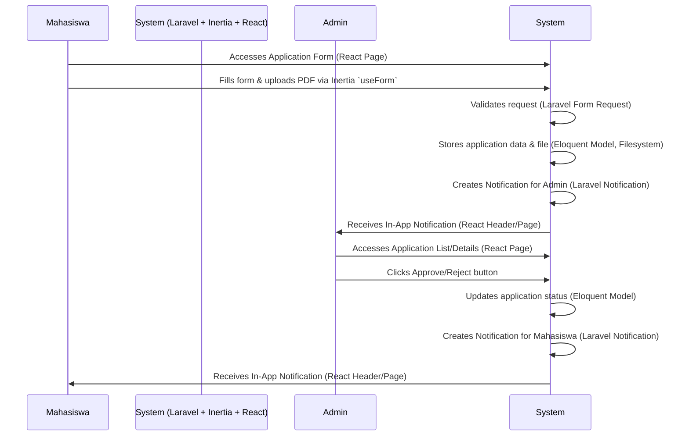
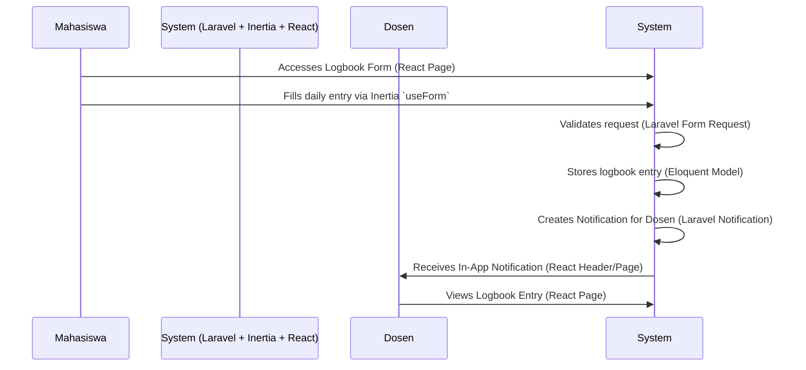
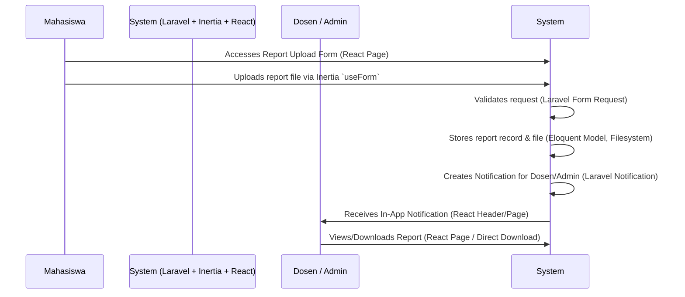
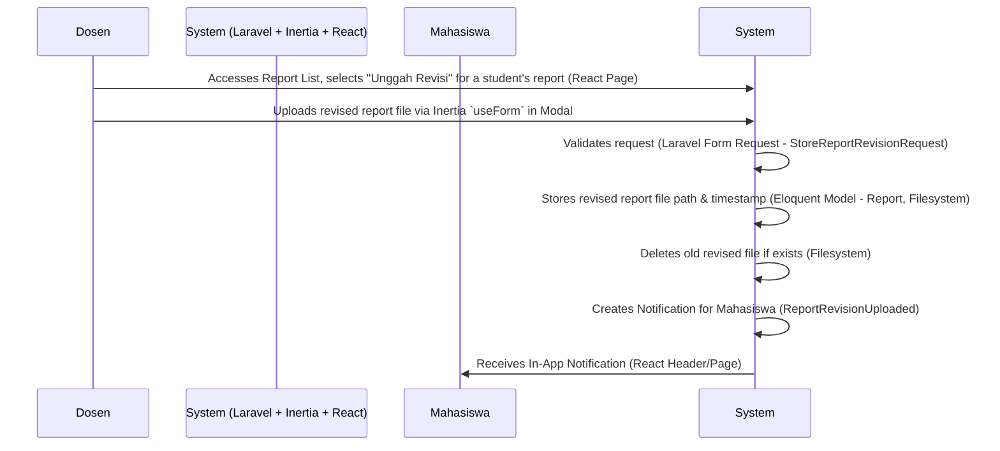

# System Patterns

This document outlines the key architectural patterns, workflows, and system interactions within the internship management system (Manajement Magang).

## Core System Flows (Simplified)

### 1. Internship Application Flow

### 2. Logbook Management Flow (Student Entry)

### 3. Report Submission Flow (Student Submission)

### 3.1. Report Revision Upload Flow (Dosen Upload)

## Architectural Patterns

1.  **Model-View-Controller (MVC) Variant (Laravel Backend):**
    - **Models:** Eloquent models (`app/Models/`) define data structure and relationships.
    - **Views:** Handled by React components rendered via Inertia. Blade templates (`resources/views/app.blade.php`) serve as the base entry point.
    - **Controllers:** (`app/Http/Controllers/`) Handle HTTP requests, interact with models, perform business logic, and return Inertia responses (`Inertia::render`).
2.  **Single Page Application (SPA) via Inertia.js:**
    - Laravel backend provides data to React frontend via Inertia responses.
    - Frontend navigation handled by Inertia links (`<Link>`), avoiding full page reloads.
    - React components (`resources/js/pages/`) act as "pages".
3.  **Component-Based UI (React):**
    - UI built using reusable React components (`resources/js/components/`).
    - Heavy reliance on Shadcn UI components (`resources/js/components/ui/`) for base elements (Buttons, Forms, Tables, Dialogs, etc.).
    - Layout components (`resources/js/layouts/`) define overall page structure.

## Backend Patterns (Laravel)

1.  **Eloquent ORM:** Used for database interaction, defining relationships (HasMany, BelongsTo, etc.).
2.  **Form Requests:** (`app/Http/Requests/`) Used for validation and authorization logic before controller actions.
3.  **Middleware:** (`app/Http/Middleware/`) Used for handling cross-cutting concerns like authentication (`auth`), Inertia requests (`HandleInertiaRequests`), role/permission checks (`role`, `permission` from Spatie).
4.  **Notifications:** Laravel's Notification system used, primarily with the `database` channel for In-App notifications.
5.  **Filesystem Abstraction:** Used for handling file uploads and storage (`Storage` facade).
6.  **Routing:** Defined in `routes/*.php` files. `Route::resource` used for standard CRUD routes. Ziggy package shares routes with the frontend.
7.  **Soft Deletes:** Trait used on models to allow for recoverable deletion.
8.  **Events/Listeners:** Used implicitly by some packages (e.g., Notifications), but custom application events are not heavily used yet.

## Frontend Patterns (React / TypeScript / Inertia)

1.  **Inertia `useForm` Hook:** Standard way to handle form submissions, validation errors, and loading states.
2.  **Inertia `<Link>` Component:** Used for SPA navigation.
3.  **Props Drilling / Context API:** Props passed down from page components. React Context API used for global state like appearance (`use-appearance.tsx`).
4.  **Custom Hooks:** Used for abstracting reusable logic (e.g., `use-debounce`, `use-initials`, `use-mobile`).
5.  **Conditional Rendering:** Used extensively to show/hide UI elements based on user roles, permissions, or data state.
6.  **TypeScript:** Used for static typing of props, state, and function signatures. Interfaces/Types defined in `resources/js/types/`.
7.  **Shadcn UI Component Usage:** Consistent use of components like `<Card>`, `<Button>`, `<Input>`, `<Table>`, `<Dialog>`, `<Tooltip>`, `<DropdownMenu>`, etc.
8.  **Toast Notifications:** `sonner` library used for brief feedback messages after actions.
9.  **Confirmation Dialogs:** `<AlertDialog>` used before destructive actions (e.g., delete).

## Testing Patterns (Pest PHP)

1.  **Feature Tests:** Primary testing method, simulating HTTP requests to test application behavior from the outside in. Located in `tests/Feature/`.
2.  **`RefreshDatabase` Trait:** Used in test classes to migrate the database before each test and wrap it in a transaction, ensuring a clean state. Uses SQLite `:memory:`.
3.  **Factories:** Laravel factories used to generate model instances for testing (`database/factories/`).
4.  **HTTP Assertions:** Pest/Laravel's built-in assertions used to verify responses (`assertStatus`, `assertInertia`, `assertRedirect`, `assertSee`, `assertDontSee`, etc.).
5.  **Authentication Helpers:** `actingAs($user)` used to simulate logged-in users.
6.  **Database Assertions:** `assertDatabaseHas`, `assertDatabaseMissing` used to verify database state changes.
7.  **Inertia Assertions:** `assertInertia` used to check props passed to React components.

## Data Flow Patterns

1.  **Request Lifecycle (Typical Inertia Request):**
    - User interacts with React UI (e.g., clicks `<Link>`).
    - Inertia makes XHR request to Laravel backend.
    - Laravel routing directs request to a Controller method.
    - Middleware (Auth, Inertia, Roles) executes.
    - Controller fetches data (Eloquent), performs logic.
    - Controller returns `Inertia::render('PageName', ['prop' => $data])`.
    - `HandleInertiaRequests` middleware adds shared props.
    - Inertia receives JSON response.
    - React updates the relevant page component with new props.
2.  **Form Submission:**
    - User fills form managed by `useForm`.
    - `useForm` POSTs data to Laravel endpoint.
    - Laravel Form Request validates data.
    - Controller processes valid data (saves to DB, etc.).
    - Controller typically redirects back or returns an Inertia response.
    - If validation fails, Laravel returns errors; `useForm` automatically populates its `errors` object.
3.  **Notifications:**
    - Backend action triggers a Notification class (`User->notify(new NotificationClass())`).
    - Notification sent via `database` channel, stored in `notifications` table.
    - Frontend periodically fetches unread notifications (e.g., via shared Inertia props or dedicated API call) for header display.
    - Notification history page fetches all notifications via API.

## Security Patterns

1.  **Authentication:** Handled by Laravel Fortify/Sanctum (adapted for Inertia sessions).
2.  **Authorization:**
    - Route Middleware (`role:admin`, `permission:edit articles`).
    - Controller Authorization (`$this->authorize('update', $post)`).
    - Conditional rendering in Frontend based on user roles/permissions passed via props.
3.  **Input Validation:** Laravel Form Requests on the backend.
4.  **CSRF Protection:** Handled automatically by Laravel/Inertia.
5.  **XSS Protection:** React inherently helps prevent XSS by escaping content. Backend validation/sanitization adds another layer.
6.  **Mass Assignment Protection:** Eloquent's `$fillable`/`$guarded` properties used.

[2025-05-09 01:05:36] - Pest Test Description Format: Use `test('[Actor Role] [can/cannot] [Action] [Subject] [Condition]')` for consistency across feature tests (e.g., `ReportCrudTest`, `LogbookCrudTest`, `InternshipCrudTest`).
