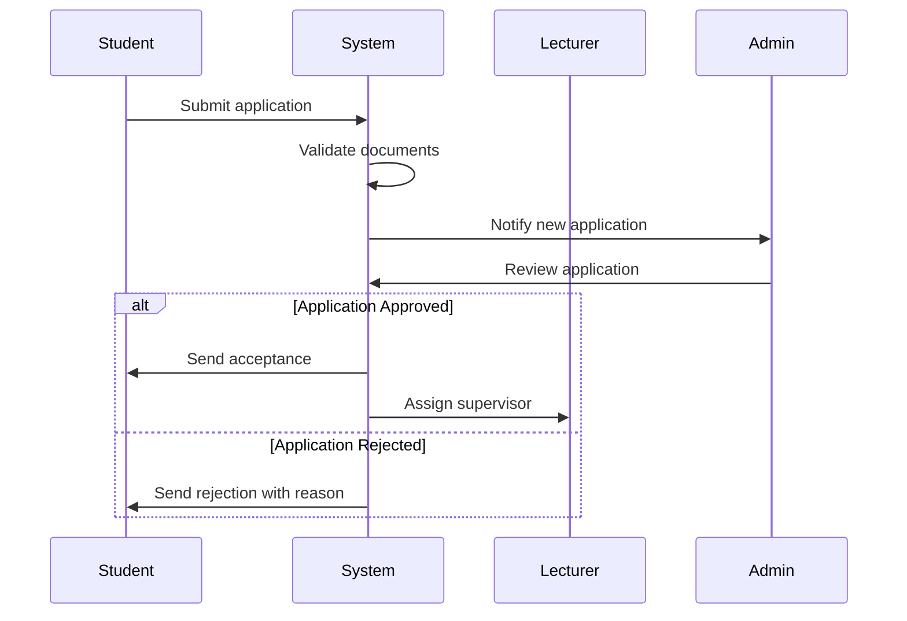
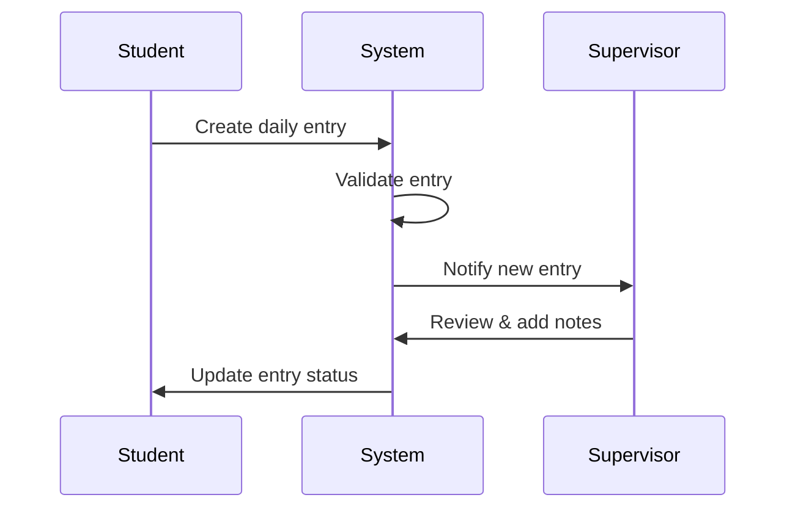
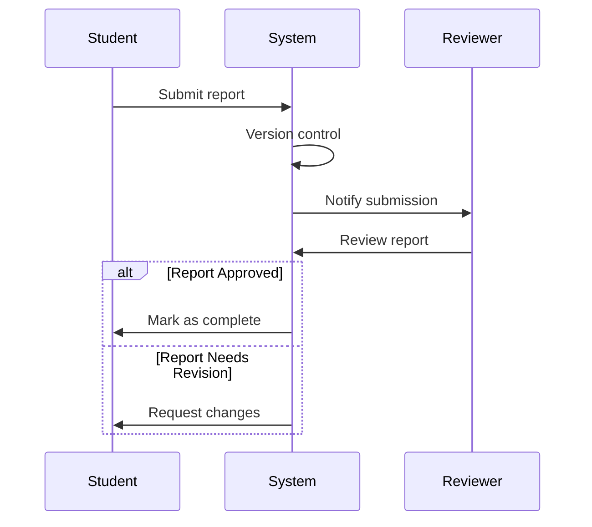

# System Patterns

This document outlines the key architectural patterns, workflows, and system interactions within the internship management system.

## Core System Flows

### 1. Internship Application Flow



### 2. Logbook Management Flow



### 3. Report Submission Cycle



## Design Patterns

### 1. Repository Pattern

- Consistent data access layer
- Separation of database logic
- Reusable query patterns

Example Implementation:

```php
class InternshipRepository
{
    public function findByStatus(string $status)
    public function findByUser(User $user)
    public function updateProgress(Internship $internship, int $progress)
}
```

### 2. Service Layer Pattern

- Business logic encapsulation
- Transaction management
- Cross-cutting concerns

Example Structure:

```php
class InternshipService
{
    public function processApplication(array $data)
    public function updateStatus(Internship $internship, string $status)
    public function calculateProgress(Internship $internship)
}
```

### 3. Event-Driven Architecture

- Application events
- Webhooks (future implementation)
- Real-time updates

Common Events:

- InternshipStatusChanged
- LogbookEntryCreated
- ReportSubmitted
- GuidanceClassScheduled

## Component Patterns

### 1. Form Handling

```typescript
interface FormState {
    data: Record<string, any>;
    errors: Record<string, string>;
    processing: boolean;
}
```

### 2. Data Table Pattern

```typescript
interface DataTableProps<T> {
    data: T[];
    columns: ColumnDef<T>[];
    meta: TableMeta;
    filters?: ReactNode;
}
```

### 3. File Upload Pattern

```typescript
interface FileUploadProps {
    accept: string[];
    maxSize: number;
    onUpload: (file: File) => Promise<void>;
}
```

## Security Patterns

### 1. Authorization Gates

```php
Gate::define('update-internship', function (User $user, Internship $internship) {
    return $user->id === $internship->user_id || $user->hasRole(['admin', 'supervisor']);
});
```

### 2. Validation Chains

```php
class StoreInternshipRequest extends FormRequest
{
    public function rules(): array
    {
        return [
            'type' => ['required', 'in:kkl,kkn'],
            'application_file' => ['required', 'file', 'mimes:pdf', 'max:2048'],
        ];
    }
}
```

## Integration Patterns

### 1. API Response Structure

```typescript
interface ApiResponse<T> {
    data: T;
    meta?: Record<string, any>;
    errors?: Record<string, string[]>;
}
```

### 2. Error Handling Pattern

```typescript
try {
    // Operation
} catch (error) {
    if (error instanceof ValidationError) {
        // Handle validation errors
    } else if (error instanceof AuthorizationError) {
        // Handle authorization errors
    } else {
        // Handle unexpected errors
    }
}
```

## UI/UX Patterns

### 1. Layout Structure

```
BaseLayout
├── AdminLayout
│   ├── Sidebar
│   ├── Header
│   └── Content
└── FrontLayout
    ├── Navbar
    ├── Content
    └── Footer
```

### 2. Form Components

- Input with validation
- File upload with preview
- Rich text editor
- Date picker

### 3. Notification System

- Toast notifications
- Status updates
- Error messages
- Success confirmations

## Data Flow Patterns

### 1. CRUD Operations

- Standard REST endpoints
- Bulk operations support
- Soft delete implementation

### 2. Search and Filter

- Global search
- Advanced filters
- Sorting capabilities

### 3. Pagination

- Server-side pagination
- Dynamic page size
- Total count handling
